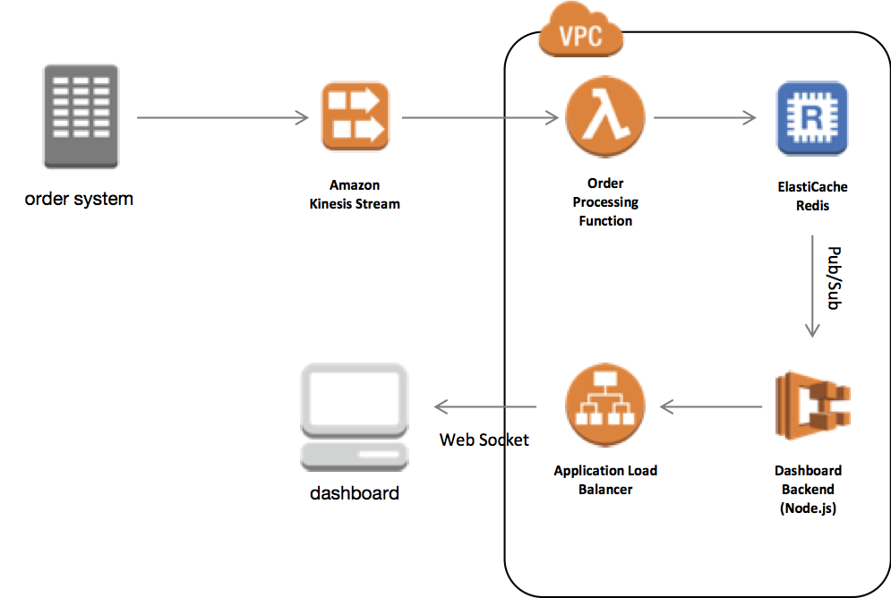

# elasticache-retail-leaderboard-demo

Most often, when we discuss Amazon ElastiCache, it is in the context of enhancing the performance of read-heavy database workloads. We update our application to employ a read-through or write-through pattern to keep data in the cache fresh and ease the burden on the database. ElastiCache though can deliver a great number of other benefits that not only make your workload more performant, but also deliver new capabilities.

To demonstrate some of those benefits, we will build a sample sales analytics dashboard using [Amazon ElastiCache](https://aws.amazon.com/elasticache/) as well as several other AWS services. More details on the ElastiCache features used here can be found in the accompanying [blog post](insert link).

## Getting Started

To get started, clone this repository. The repository contains [AWS CloudFormation](https://aws.amazon.com/cloudformation/) templates, deployment scripts, and source code to deploy and run the sample.

### Prerequisites

To run the sample, you will need to:

1. Select an AWS region.
2. An SSH client (e.g.PuTTY on Windows)
3. Create an EC2 Key Pair in the region you selected ([additional detail](https://docs.aws.amazon.com/AWSEC2/latest/UserGuide/ec2-key-pairs.html#having-ec2-create-your-key-pair)). *YOU MUST DOWNLOAD THE PRIVATE KEY NOW. IT CAN'T BE DONE AT A LATER TIME.*


## Deployment

We will use both CloudFormation and provided command line scripts to manage the deployment of all required resources for the environment. The CloudFormation templates are deployed in two steps. The first will create a stack containing a VPC, subnets, security groups as well as an ElastiCache cluster, Kinesis Stream, and Lambda function to ingest mock orders. This first template will also create two [Amazon Elastic Container Registries](https://aws.amazon.com/ecr/) that will be used to serve the dashboard.



### Create the cloudformation stack

In the link below, provide the following information

1. Provide a stack name
2. Provide the key name
3. Acknowledge `I  acknowledge that AWS CloudFormation might create IAM resources.`
4. Acknowledge `I acknowledge that AWS CloudFormation might create IAM resources with custom names.`
5. Click `Execute`

Launch In:
* us-east-1 [](https://console.aws.amazon.com/cloudformation/home?region=us-east-1#/stacks/create/review?stackName=elasticache-retail-dashboard&templateURL=https://s3.amazonaws.com/elasticache-retail-dashboard/template.yaml)
* us-east-2 [](https://console.aws.amazon.com/cloudformation/home?region=us-east-2#/stacks/create/review?stackName=elasticache-retail-dashboard&templateURL=https://s3.amazonaws.com/elasticache-retail-dashboard/template.yaml)
* us-west-1 [](https://console.aws.amazon.com/cloudformation/home?region=us-west-1#/stacks/create/review?stackName=elasticache-retail-dashboard&templateURL=https://s3.amazonaws.com/elasticache-retail-dashboard/template.yaml)
* us-west-2 [](https://console.aws.amazon.com/cloudformation/home?region=us-west-2#/stacks/create/review?stackName=elasticache-retail-dashboard&templateURL=https://s3.amazonaws.com/elasticache-retail-dashboard/template.yaml)
* ca-central-1 [](https://console.aws.amazon.com/cloudformation/home?region=ca-central-1#/stacks/create/review?stackName=elasticache-retail-dashboard&templateURL=https://s3.amazonaws.com/elasticache-retail-dashboard/template.yaml)
* eu-west-1 [](https://console.aws.amazon.com/cloudformation/home?region=eu-west-1#/stacks/create/review?stackName=elasticache-retail-dashboard&templateURL=https://s3.amazonaws.com/elasticache-retail-dashboard/template.yaml)
* eu-west-2 [](https://console.aws.amazon.com/cloudformation/home?region=eu-west-2#/stacks/create/review?stackName=elasticache-retail-dashboard&templateURL=https://s3.amazonaws.com/elasticache-retail-dashboard/template.yaml)


After the first stack has finished, we will build the Docker images for the app and backend of the dashboard and deploy them to the ECR Repositories created by CloudFormation. First, connect to the ECR Repositories:

Connect to the instance with an SSH client. First, we need to find the IP Address of the instance that was created. To find the IP, go to the Cloudformation console and look at the outputs section for `HostIP`.

Once you find the Host IP, create an SSH connection though the terminal in OSX or PuTTY in Windows. 

OSX: 
```
ssh -i <Path/To/KeyFile.pem> ec2-user@<HostIP From Cloudformation output>
```
*You will need the private key you downloaded when you created the KeyPair above.*

Windows: [Click here](https://docs.aws.amazon.com/AWSEC2/latest/UserGuide/putty.html) for detailed instructions.

Copy the source code:
```
$ aws s3 sync s3://elasticache-retail-dashboard/code /home/ec2-user/lab  
```


Once you create the ssh connection login to ECR with the following command:

``` bash
$ $(aws ecr get-login --no-include-email)
```


Next, we will build and push two Docker images to their respecitive repositories:

``` bash
$ cd lab
# Dashboard App, i.e. "frontend" -> DashboardURI below
$ export ECR_DASHBOARD_REPO=$(aws cloudformation describe-stacks --stack-name elasticache-retail-dashboard \
                     --query 'Stacks[*].Outputs[?OutputKey==`EcrDashboardRepository`].OutputValue' \
                     --output text)

$ cd app
$ docker build -t elasticache-dashboard .
$ docker tag elasticache-dashboard:latest $ECR_DASHBOARD_REPO:latest 
$ docker push $ECR_DASHBOARD_REPO:latest

# Dashboard App Backend -> BackendURI below
$ export ECR_BACKEND_REPO=$(aws cloudformation describe-stacks --stack-name elasticache-retail-dashboard \
                     --query 'Stacks[*].Outputs[?OutputKey==`EcrBackendRepository`].OutputValue' \
                     --output text)
$ cd ..
$ cd backend
$ docker build -t elasticache-backend .
$ docker tag elasticache-backend:latest $ECR_BACKEND_REPO:latest 
$ docker push $ECR_BACKEND_REPO:latest

```

Finally, we will use the second CloudFormation template to create the [Amazon ECS](https://aws.amazon.com/ecs/) cluster and two services using [AWS Fargate](https://aws.amazon.com/fargate/):

``` bash
$ cd ..

$ cd lambda

$ npm install

$ cd ..

$ export LAMBDA_DEPLOY=$(aws cloudformation describe-stacks --stack-name elasticache-retail-dashboard --query 'Stacks[*].Outputs[?OutputKey==`CodeBucket`].OutputValue' --output text)

$ sam package --template-file ecs.yaml \
              --s3-bucket $LAMBDA_DEPLOY \
              --s3-prefix deploy-lambda/ \
              --output-template-file packaged-ecs.yaml

$ sam deploy --template-file packaged-ecs.yaml \
             --stack-name elasticache-retail-dashboard-ecs \
             --capabilities CAPABILITY_IAM \
             --parameter-overrides StackName=elasticache-retail-dashboard
```

## Run!

Next, we will generate one week of mock order data and push it to ElastiCache via [Amazon Kinesis](https://aws.amazon.com/kinesis/) and an [AWS Lambda](https://aws.amazon.com/lambda/) function. Before generating data, we suggest opening the dashboard app in your browser, it will update as new order data is processed.

To find the URL for your dashboard:

``` bash

$ aws cloudformation describe-stacks --stack-name elasticache-retail-dashboard-ecs \
                     --query 'Stacks[*].Outputs[?OutputKey==`AppUrl`].OutputValue' \
                     --output text
```

As part of this sample, we have provided a simple command line tool that will generate random order data for the past week. The tool pushes data to a Kinesis Stream. To retrieve the name of this stream (referenced as `KINESIS_STREAM`):

``` bash
$ export KINESIS_STREAM=$(aws cloudformation describe-stacks --stack-name elasticache-retail-dashboard-ecs \
                     --query 'Stacks[*].Outputs[?OutputKey==`KinesisStream`].OutputValue' \
                     --output text)
```

Finally, let's generate the data:

``` bash
$ cd producer

$ npm install

$ npm start generateOrders $KINESIS_STREAM
```

Within a few minutes, you should see data populating in the Dashboard App!


## Cleaning Up

Finally, we can clean up the environment using the AWS CLI and CloudFormation:

First, Navigate to the [aws console](https://console.aws.amazon.com/ecs/home#/repositories)

Select `stackname`-dashboard repository, select all the images and click delete.

Select `stackname`-backend repository, select all the images and click delete.

Go to the [CloudFormation Console](https://console.aws.amazon.com/cloudformation/home)

Select `stackname`-ecs and select delete. Wait for this to complete.
Select `stackname` and select delete.


## License Summary

This sample code is made available under a modified MIT license. See the LICENSE file.

## Authors

* **jkahn** - *initial work*
* **gillemi** - *initial work*
